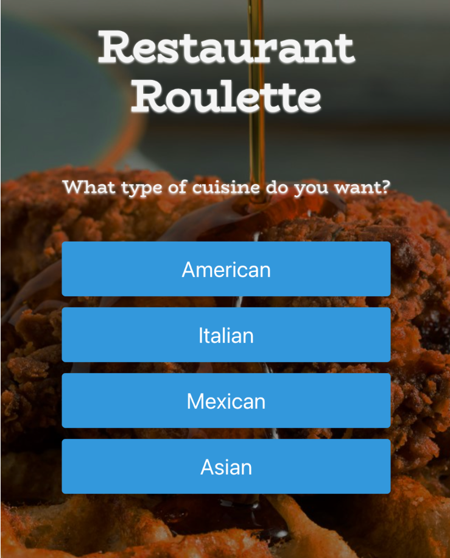

# restaurant-roulette
App asks users to enter basic criteria of what they are looking for (cuisine, location/distance, etc).  Will populate a “spin the wheel” button that picks a random result and then links map/delivery links.  API’s that we used: zippopotamus, zomato, google maps…

## User Story

As a hungry person
I want to eat something
But I am indecisive
So I want the restaurant roulette app to decide for me

## Acceptance Criteria

GIVEN a Food dashboard 
WHEN I enter a zipcode and select "Let's Eat!" button
THEN user is presented with cuisine options of "American, Italian, Mexican, Asian"
WHEN I select a cuisine option, I am promted to select a radius range
THEN user is presented with radius range options
WHEN I set the radius range filter, then I am presented with a results page
Then a randomly generated restaurant option is provided with a name, google map and relavant google reviews.
Bon Appetit!

## Deployment: Live URL

<https://johnsonr84.github.io/restaurant-roulette/>

The following image shows the web application's appearance and functionality:

Step 1 - Enter Zipcode and select "Let's Eat"

Step 2 - Choose your desired cuisine

Step 3 - Set the radius distance to which you are willing to travel

Step 4 - Your results will be displayed and your food journey will begin!

